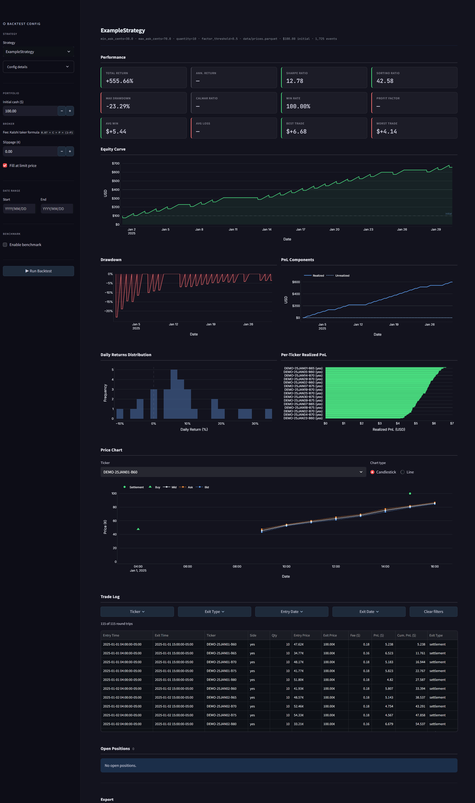

# Prediction Market Backtest Framework

   

Event-driven backtesting engine for binary prediction markets (Kalshi, Polymarket, PredictIt, and others), with an interactive Streamlit UI.

---

## Quick Start

```bash
pip install -r requirements.txt   # Python 3.9+

python make_sample_data.py        # generate demo data
streamlit run backtest/app.py     # open http://localhost:8501
```

Click **▶ Run Backtest** in the sidebar — you should see an equity curve, trade log, and performance metrics.



---

## Project Structure

```
backtest/
  engine.py                    # wires everything together
  broker.py                    # simulates order fills
  app.py                       # Streamlit UI
  feeds/
    prediction_market_price_feed.py       # bid/ask snapshots from parquet
    prediction_market_resolution_feed.py  # settlement results from parquet
    factor_feed.py             # optional prediction/factor data
    generic_ohlcv_feed.py      # OHLCV support (equities, futures, etc.)
  reporting/
    metrics.py                 # Sharpe, drawdown, win rate, round trips

core/
  events.py                    # event dataclasses (Signal, Fill, Resolution …)
  event_bus.py                 # dispatches events to subscribers
  portfolio.py                 # tracks cash, positions, equity curve
  risk_manager.py              # PassthroughRiskManager (extend for limits)
  constants.py                 # enums: Side, Action, OrderType …

strategies/
  base.py                      # Strategy base class
  example/
    example_strategy.py        # minimal working example — start here
    backtest.yaml              # config for the Streamlit UI
```

---

## Writing a Strategy

Subclass `Strategy`, implement `on_market_data`, and publish a `Signal` to place an order.

```python
# strategies/my_strategy/my_strategy.py
from strategies.base import Strategy
from core.constants import Action, OrderType, Side
from core.events import PredictionMarketSnapshot, Signal

class MyStrategy(Strategy):
    def __init__(self, threshold: float = 40.0, quantity: int = 10, strategy_id: str = ""):
        super().__init__()
        self.threshold   = threshold
        self.quantity    = quantity
        self.strategy_id = strategy_id

    def on_market_data(self, event: PredictionMarketSnapshot) -> None:
        if event.side != Side.YES or event.ask > self.threshold:
            return

        self._publish(Signal(
            timestamp   = event.timestamp,
            ticker      = event.ticker,
            signal_type = "my_signal",
            value       = event.ask,
            strategy_id = self.strategy_id,
            metadata    = {
                "side":        Side.YES,
                "action":      Action.BUY,
                "quantity":    self.quantity,
                "order_type":  OrderType.LIMIT,
                "limit_price": event.ask,
            },
        ))
```

Other hooks (all optional):

| Method | Triggered when |
|---|---|
| `on_market_data(event)` | new bid/ask snapshot |
| `on_factor(event)` | prediction/factor value injected |
| `on_fill(event)` | your order is filled |
| `on_resolution(event)` | market settles YES or NO |
| `on_expiry(event)` | market expires without settlement |

### Add to the UI

**1. Create a config** — copy `strategies/example/backtest.yaml` and edit:

```yaml
# strategies/my_strategy/backtest.yaml
strategy:   MyStrategy
instrument: prediction_market

threshold:        40.0
quantity:         10
factor_threshold: 0.5   # optional — gate trading by factor value

price:
  - path: data/prices.parquet

resolutions:
  - path: data/resolutions.parquet

# optional: inject a daily factor (model output, external signal, etc.)
# factors:
#   - series:    MY_SERIES
#     pred_path: data/factors.parquet
#     value_col: value             # column name in parquet (default: "value")
```

All keys outside `strategy`, `instrument`, `price`, `resolutions`, and `factors` are passed as kwargs to `__init__`.

**2. Register in `app.py`:**

```python
from strategies.my_strategy.my_strategy import MyStrategy

STRATEGY_REGISTRY = {
    "ExampleStrategy": ExampleStrategy,
    "MyStrategy":      MyStrategy,
}
```

**3. Run the UI** and select your strategy from the dropdown.

---

## Running from Python

```python
from backtest.engine import BacktestEngine
from backtest.broker import PredictionSimulatedBroker, BrokerConfig
from backtest.feeds.prediction_market_price_feed import PredictionMarketPriceFeed
from backtest.feeds.prediction_market_resolution_feed import PredictionMarketResolutionFeed
from core.event_bus import EventBus
from core.portfolio import Portfolio
from strategies.example.example_strategy import ExampleStrategy

strategy  = ExampleStrategy(min_ask_cents=30, max_ask_cents=70, quantity=10)
portfolio = Portfolio(initial_cash=10_000)   # in cents — $100

engine = BacktestEngine(
    bus=EventBus(),
    broker=PredictionSimulatedBroker(BrokerConfig()),
    portfolio=portfolio,
    strategy=strategy,
    feeds=[
        PredictionMarketPriceFeed("data/prices.parquet"),
        PredictionMarketResolutionFeed("data/resolutions.parquet"),
    ],
)
engine.run()

print(f"Equity:       ${portfolio.equity / 100:.2f}")
print(f"Realized PnL: ${portfolio.realized_pnl / 100:.2f}")
```

---

## Data Format

Parquet prices are in **dollars (0–1)**; feeds convert to **cents (0–100)** internally.

### prices.parquet

| Column | Type | Description |
|---|---|---|
| `ts` | datetime (UTC) | snapshot timestamp |
| `ticker` | str | e.g. `KXHIGHNY-25MAY16-B85.5` |
| `bid_close` | float | YES bid (0–1) |
| `ask_close` | float | YES ask (0–1) |
| `price_close` | float | last trade price (0–1) |
| `volume` | int | volume |

### resolutions.parquet

| Column | Type | Description |
|---|---|---|
| `ticker` | str | market ticker |
| `close_time` | datetime (UTC) | settlement time |
| `result` | str | `"yes"` or `"no"` |

### factors.parquet (optional)

One row per day. Used to gate or weight orders in `on_factor`.

| Column | Type | Description |
|---|---|---|
| `date` | date | target date |
| `value` | float | factor value (any scale — your strategy interprets it) |
| `model_id` | str | optional — model/source label |

---

## License

MIT
